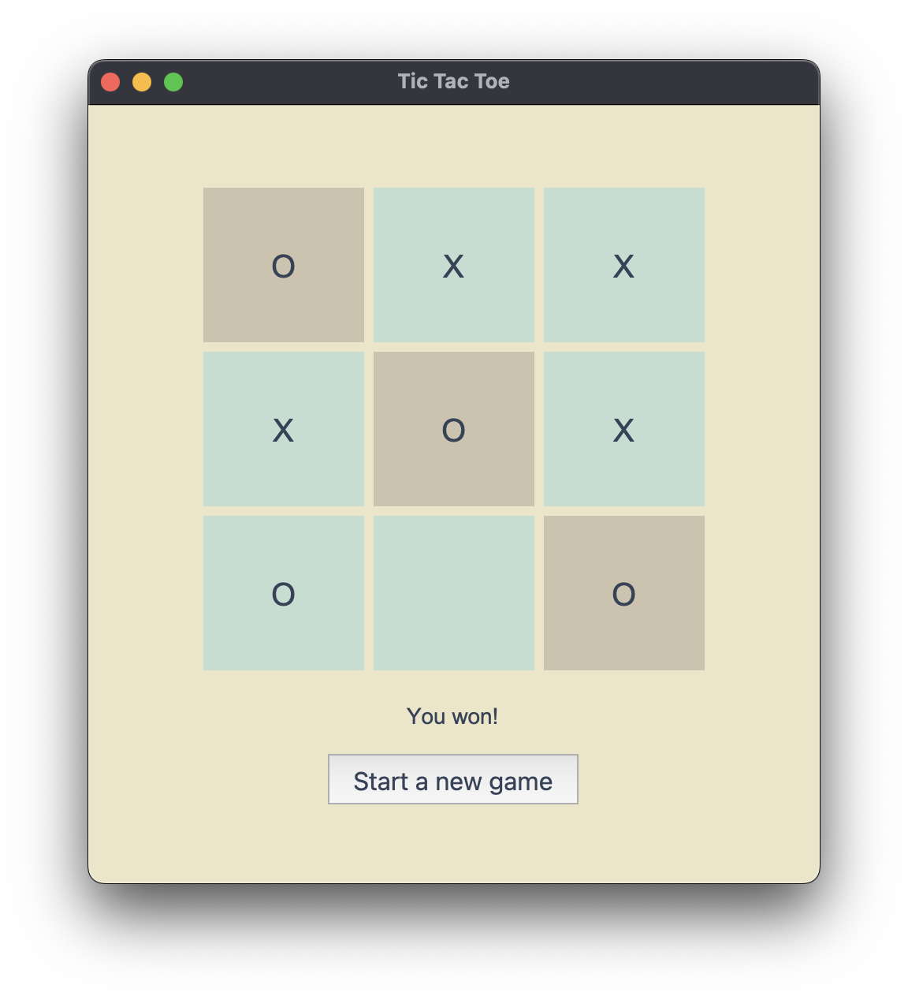

# py02_TicTacToe

Homework for *100 Days of Code: The Complete Python Pro Bootcamp for 2022*

A Tic Tac Toe game.

* Click "start a new game" button to start.
* The game randomly decides who goes first when the game starts.
* The opponent does not have any strategy, it just randomly clicks a remaining cell.
* Does not have game records currently.`

## Reference

* [Stack Overflow - How to pass arguments to a Button command in tkinter?](https://stackoverflow.com/questions/6920302/how-to-pass-arguments-to-a-button-command-in-tkinter)
* [A series of tkinter tutorial youtube videos by Codemy.com](https://www.youtube.com/playlist?list=PLCC34OHNcOtoC6GglhF3ncJ5rLwQrLGnV)

:four_leaf_clover::whale: